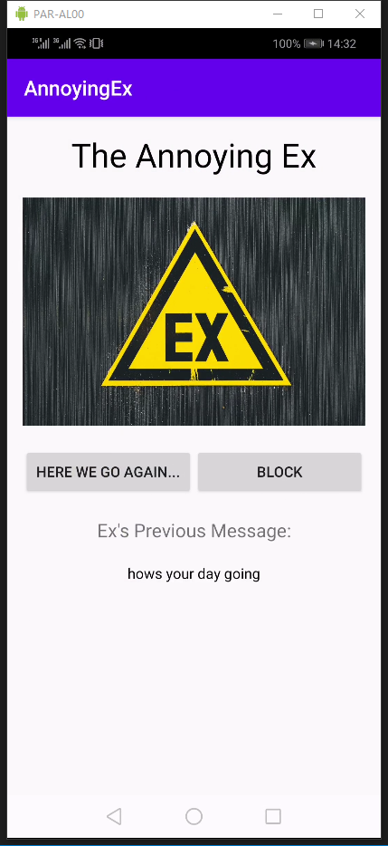
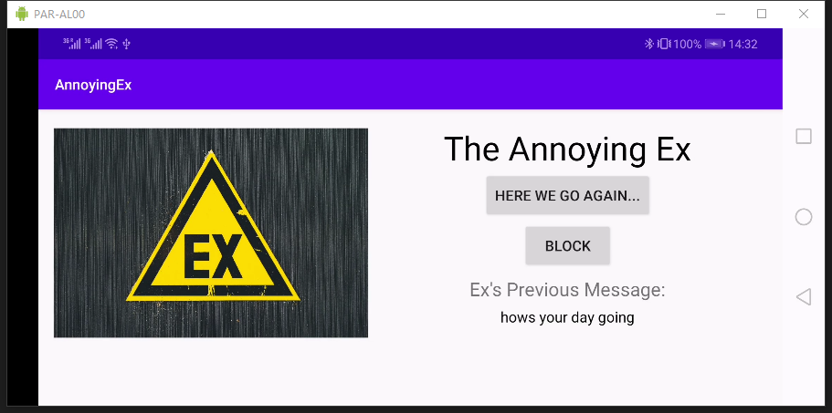

# AnnoyingEx
This is an app written in Kotlin for the Andriod Mobile Development class taught at the [University of Washington Information School](https://ischool.uw.edu/). 

Author: Haoyang (Eric) Chen

Homework5 - Background Tasks & Notifications

## Description
This app fetches annoying messages from Ex in the format of JSON and stores the messages. When the user clicks the "Here we go again..." button, the app will start a repetitive task that posts a notification from your Ex every 20 minutes when the device is charging. The user can click on the notification to launch the app and the notification will should auto dismiss. User can choose to give closure to this relationship by clicking the "Block" button. Doing so will stop all future messages from your Ex.

## Extra Credit
I've completed extra credit 1 & 2. 

Specifically, I implemented the additional feature of displaying the text that was in the notification in the app and create a separate worker that runs every 2 days that fetches JSON only when the device's battery is not low and is connected to a network.

## Screenshot
Screenshots of the app running on a device emulator

